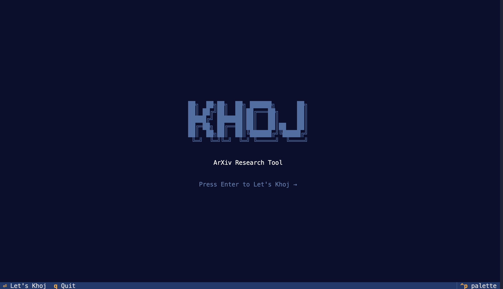
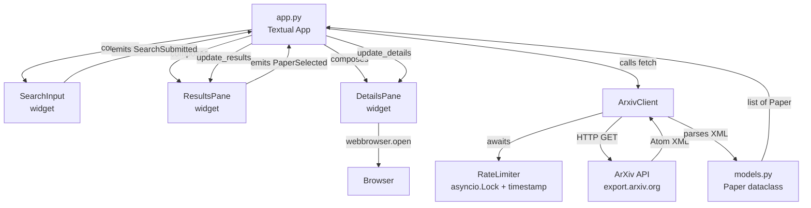
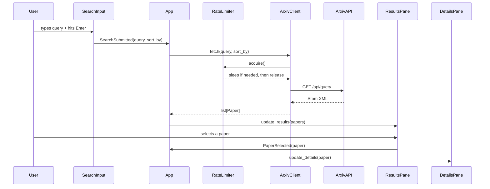

# Khoj — ArXiv Research Tool


A terminal-based ArXiv research tool built with Python and Textual. Search papers, browse results, and read summaries without leaving your terminal.

---

## Home Screen

<!-- Add a screenshot of the home screen here -->
<!-- Recommended: run `khoj`, take a screenshot, save as `assets/screenshot.png`, then uncomment the line below -->



---

## Install

Requires Python 3.10+ and [`uv`](https://docs.astral.sh/uv/).

```bash
uv tool install git+https://github.com/snehaldutta/khoj-arXiv-tool.git
```

Then run from anywhere:

```bash
khoj
```

To update to the latest version:

```bash
uv tool upgrade arxiv-rtool
```

To uninstall:

```bash
uv tool uninstall arxiv-rtool
```

---

## Features

- Search ArXiv by any query with 10 relevant results
- Sort results by relevance, last updated date, or submitted date
- Browse paper titles and authors in a results pane
- Read full summaries and metadata in a detail pane
- Open papers in your browser directly from the TUI
- Async rate limiter to respect ArXiv API limits
- Navy blue and white theme throughout

---

## Keybindings

| Key     | Action                         |
|---------|--------------------------------|
| Enter   | Submit search / start the app  |
| o       | Open selected paper in browser |
| q       | Quit                           |

---

## Architecture

The project is split into four layers — models, networking, rate limiting, and UI. Each layer has a single responsibility and no layer reaches across another.



### Data Flow



---

## File Structure

```
arxiv-research-tool/
├── pyproject.toml                 # Project config
└── src/
    └── arxiv_rtool/
        ├── app.py                 # Textual App + SplashScreen
        ├── arXivClient.py         # Async HTTP fetch + XML parser
        ├── rateLimiter.py         # asyncio.Lock + timestamp gatekeeper
        ├── models.py              # Paper dataclass
        ├── app.tcss               # Styles
        └── widgets/
            ├── search_input.py    # Search bar + sort selector
            ├── results_pane.py    # ListView of results
            └── details_pane.py    # Paper detail display
```

---

## Rate Limiter Design

ArXiv asks clients to make no more than one request every 3 seconds. The `RateLimiter` class enforces this without a queue or background worker — just an `asyncio.Lock` and a timestamp:

- Lock serializes concurrent callers
- Timestamp tracks when the last request fired
- Only sleeps the remaining delta, not a full 3 seconds every time
- First request always fires immediately (`last_req_time` starts at `0.0`)

---

## Development Setup

```bash
git clone https://github.com/your-username/arxiv-research-tool
cd arxiv-research-tool
uv sync
uv run khoj
```

---

## Contributing

Contributions are welcome. A few areas that would make good first contributions:

- **Status bar** — show "Searching...", "N results found", or "Try again later" during and after fetch
- **Keyboard navigation** — `j/k` vim-style movement through the results list
- **Pagination** — load more than 10 results with a "Load more" action
- **Search history** — cycle through previous queries with arrow keys
- **Category filter** — let users filter by ArXiv category (cs.AI, math, physics etc.)
- **Abstract copy** — keybinding to copy the summary to clipboard

To contribute, fork the repo, create a branch, and open a pull request. Please keep changes focused — one feature or fix per PR.

---

## Stack

| Tool | Purpose |
|------|---------|
| [Textual](https://github.com/Textualize/textual) | TUI framework |
| [httpx](https://www.python-httpx.org/) | Async HTTP client |
| `xml.etree.ElementTree` | Atom XML parsing (stdlib) |
| `asyncio` | Async runtime + rate limiter |
| `webbrowser` | Opening paper links (stdlib) |
| [uv](https://docs.astral.sh/uv/) | Package manager + tool runner |